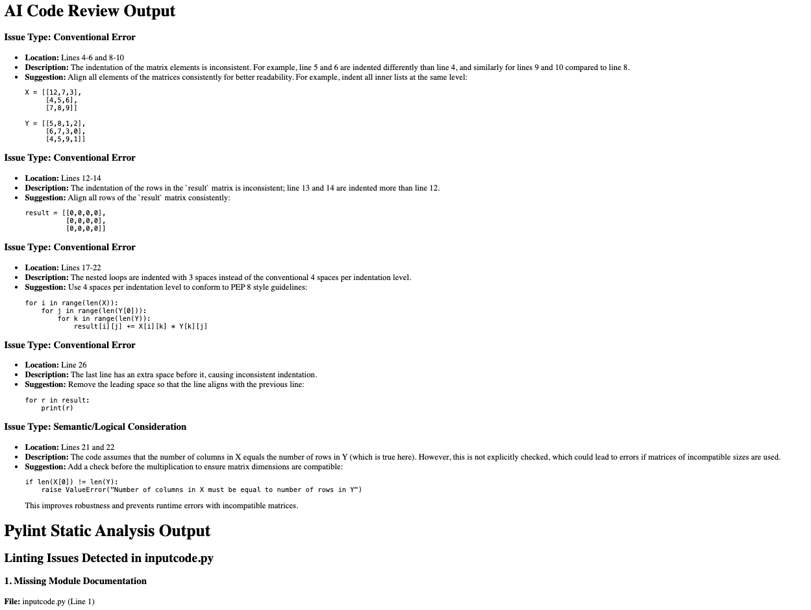
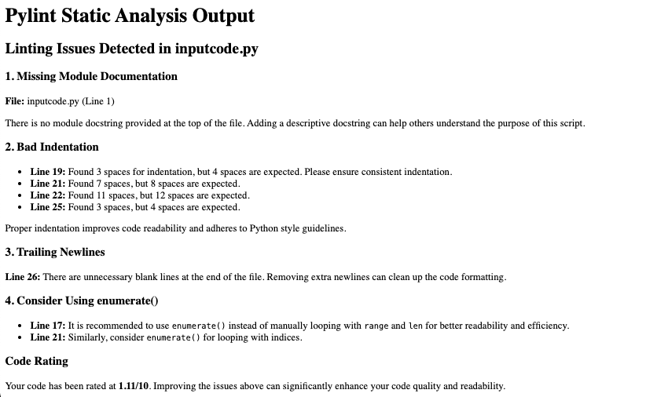

# AI Code Reviewer

<!-- Embedded Video -->
<p align="center">
  <iframe width="560" height="315" src="https://www.youtube.com/embed/9v244vSPgLE?si=FemRv5OoLKGQ6BOB" title="YouTube video player" frameborder="0" allow="accelerometer; autoplay; clipboard-write; encrypted-media; gyroscope; picture-in-picture; web-share" referrerpolicy="strict-origin-when-cross-origin" allowfullscreen></iframe>
</p>

<!-- Two Images -->
<p align="center">
  
  
</p>


The user provides their Python code by copy-pasting it into the inputfile.py file. The program then uses the OpenAI API and Pylint to analyze the code and generate feedback. I specifically designed and refined prompts using the OpenAI Prompt Playground.

The project sends both the prompt and the user’s code as an API request to OpenAI, retrieves the response, and formats the feedback. The raw Pylint output is also processed and reformatted using AI, ensuring the final result is clean and readable. The entire analysis is rendered as an HTML page using Flask.

This project was made to practice different prompting techniques and explore how LLM settings affect responses. 


## Features

- Uses openAI gpt-4.1-mini model for code analysis (looks for bugs, semantic errors, and convention suggestions)
- Uses Pylint (static analysis software) to make convention suggestions and rate the user's code quality
- Chain-of-Thought Prompting was used to guide the LLM to analyze the code
- Uses Codacy to identify and solve security risks within the repository

## Setup Instructions

### WARNING: Ensure you have your own openAI API Key and paste it in the ai_prompt.py file!

### Clone the repository

```bash
git clone https://github.com/1sakib/code-reviewer.git
cd code-reviewer
```
### Install dependencies

```bash
pip install -r requirements.txt
```

### Run the Project

```bash
python app.py
```


## License

MIT License — see LICENSE file.
